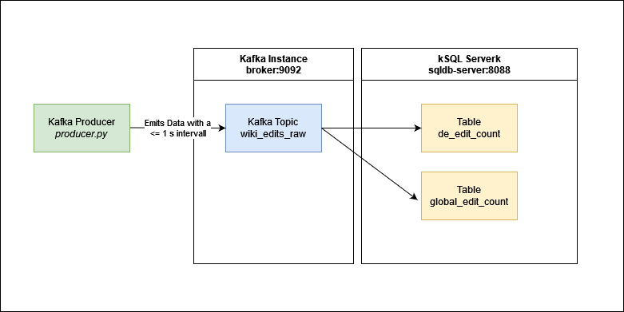

# Data Engineering Challenge

# Aim
The aim of this project was to create a mock-up kafka environment consisting of the following components

- Kafka Producer: Emits synthetic wikipedia edits with an interval between 0 and 1 s 
- Kafka Consumer: The data is processed by kSQL to produce minutewise aggregates counting global edits and the edits to the german wikipedia.
	

# How to setup:
### Kafka & Python Producer

```
#install python requirements:

pip install kafka-python, pandas
#spin up docker compose
docker compose up

#start producer:
python producer.py
```
### Aggregation mit ksql

bash into ksql_cli container:

`sudo docker exec -it ksqldb-cli ksql http://ksqldb-server:8088`

initiate ksql streams and aggregation queries:

`ksql> run script /app/queries/queries.sql;`

The results can be queried as follows:

#Globale Edits pro Minute
```
ksql> SELECT TIMESTAMPTOSTRING(WINDOWSTART, 'yyyy-MM-dd HH:mm:ss') 
       AS window_start, EDIT_COUNT FROM GLOBAL_COUNT LIMIT 5;
```

#Edits der deutschen Wikipedia pro Minute
```
ksql> SELECT TIMESTAMPTOSTRING(WINDOWSTART, 'yyyy-MM-dd HH:mm:ss') 
       AS window_start, EDIT_COUNT FROM DE_EDIT_COUNT LIMIT 5;
```
# Example Results
```
ksql> SELECT TIMESTAMPTOSTRING(WINDOWSTART, 'yyyy-MM-dd HH:mm:ss') AS window_start, EDIT_COUNT FROM GLOBAL_COUNT LIMIT 5;
+--------------------------------------------------------------------------+--------------------------------------------------------------------------+

|WINDOW_START                                                              |EDIT_COUNT                                                                |

+--------------------------------------------------------------------------+--------------------------------------------------------------------------+

|2022-06-28 20:44:00                                                       |12                                                                        |

|2022-06-28 20:45:00                                                       |122                                                                       |

|2022-06-28 20:46:00                                                       |101                                                                       |

|2022-06-28 20:47:00                                                       |114                                                                       |

|2022-06-28 20:48:00                                                       |114                                                                       |

Query terminated
```


